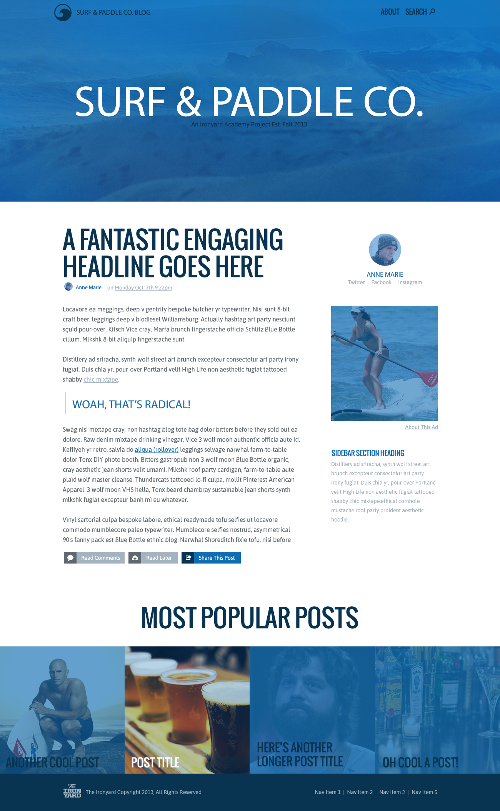

# 01/29/15

___This homework is due by 8am, on 02/02/2015___

## Description
As a developer on the web, you will sometimes be tasked with creating an html page simply from an image file.  In this assignment, you&#x27;ll be taking an image and turning it into a functioning website.

## Performance Objectives

After completing this assignment, you should be able to:

* Effectively utilize some common css layout strategies (float or inline-block)
* Leverage and understand the use of `absolute` vs `relative` in context of positioning.
*

## Details

### Surf & Paddle

Your homework today is to recreate the Surf and Paddle mockup (screenshot below).

All of the assets you should need are located in the `/assets` folder.

The menu items need to also have differing states based on a hover, and although not articulated in the provided image, they need to be styled.

This needs to be as pixel perfect as you can make it. To help with this you can use the Chrome Plugin, [PerfectPixel](http://www.welldonecode.com/perfectpixel/).

You should also use [Normalize CSS](http://necolas.github.io/normalize.css/)

Also, you will need to utilize [Google Fonts](http://www.google.com/fonts)

#### A few hints

1. Use `%`'s instead of `px` widths
2. Use break points - read more about them [here](http://alistapart.com/article/responsive-web-design)

### Fonts

* [Header Font: Oswald](https://www.google.com/fonts#UsePlace:use/Collection:Oswald)
* [Body Font: Open Sans](https://www.google.com/fonts#UsePlace:use/Collection:Open+Sans)

### Resources & Tools

* [CSS Background Images](https://developer.mozilla.org/en-US/docs/Web/CSS/background-image)
* [PerfectPixel](http://www.welldonecode.com/perfectpixel/)
* [Responsive Web Design](http://alistapart.com/article/responsive-web-design)
* [Google Fonts](http://www.google.com/fonts)
* [Normalize CSS](http://necolas.github.io/normalize.css/)
