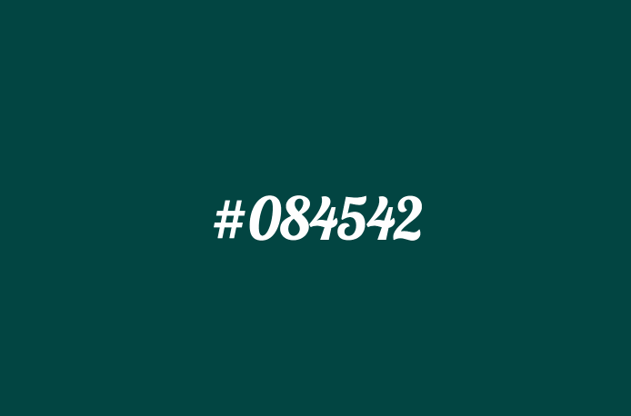

# 02/09/15

___This homework is due by 8am, on 02/10/15___

## Homework

  __Part 1.__ Create a JavaScript clock like you see in `basic.gif` below.

  * Note it does not need to be the same font, just look similiar.
  * Have fun with the design.

----

  __Part 2.__ After you have done that, modify it show as a hex color and on each second tick, change the background color to that hex color. See `hex.gif` below for reference.

----

  __Part 3.__ I would like you to also write another blog post about your first week with JavaScript. What did you learn, how do you feel about it, was it what you expected? I will be assigning a weekly blog post for each student to reflect on the week. If you do not want it public, feel free to make it private or use a pseudonym. I really enjoyed reading your blog posts last week and look forward to this weeks. I believe they gave me an insight into each of you that I did not get from class. If I really enjoy one of your blog posts (or if you talk about how great I am :bowtie:) I may ask if we can reblog it.

## Deliverables

1. Push to Github
2. Push to Github Pages
3. Comment on the assignment issued to you with links

## Go Further

  1. Create a new version of the clock, but this time actually convert it to a Hex clock. See `advanced.gif` screenshot below.

## Resources

* [setInterval](https://developer.mozilla.org/en-US/docs/Web/API/WindowTimers.setInterval)
* [$.text](http://api.jquery.com/text/)
* [$.css](http://api.jquery.com/css/)
