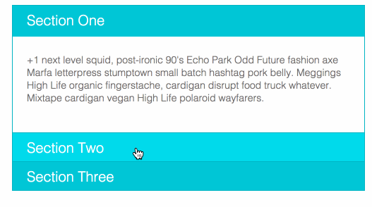

# 02/24/15

___This homework is due by 8am, on 02/25/15___


## Homework

### Part 1

Build a jQuery Accordian like the one you see below:



* It needs to have at least 3 panels
* It needs to build the accordian using JSON data loaded from an Ajax request
* have fun with the style

### Part 2

Create your own mini JS library. Here is an example

```javascript
var minilib = {

  now: function() {
    return new Date().getTime();
  },

  currentHour: function() {
    return new Date().getHours();
  },

  timeOfDay: function() {
    var hour = minilib.currentHour();
    if (hour < 12) {
      return "morning";
    }
    else if (hour < 4) {
      return "afternoon";
    }
    else if (hour < 8) {
      return "evening";
    }
    else {
      return "night";
    }
  },

  greet: function(name) {
    return "Good " + minilib.timeOfDay() + ", " + name;
  }

};
```

* Create your own mini library.
* Have at least 10 methods
* Make the methods useful, try to follow a theme if possible.
* Create your mini library BDD style write tests for the methods.


## Deliverables

* Push your repo to `gh-pages`, you should have a seperate `.html` file for your accordian, and for your mini library test.

* Comment on the issue assigned to you with links to:

  - The accordian page on gh pages
  - The test page for your mini library on gh pages
  - Your git repo
