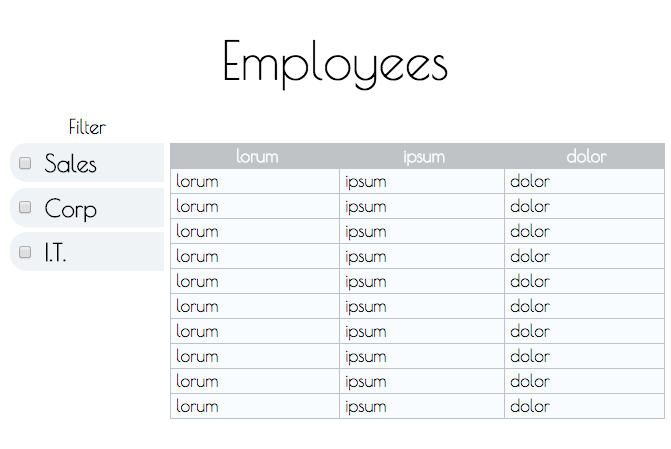

# 03/05/15

___This homework is due by 8am, on 03/09/15___

## Homework

Refactor your employee grid from [yesterday's assignment](../019) to use `Backbone.Collection` and `Backbone.View`. Also add a section where the user can select what depts they want to see like in the example screenshot below:

## Requirements

* When all (or none) are selected then it should show all the employees
* Otherwise show only the employees from the selected departments
* assign a font awesome [icon](http://fortawesome.github.io/Font-Awesome/icons/) for each department. Put this icon in each employee row in the list, and also put it next to each checkbox.
* add a start date for each employee in your data, and use [moment](http://momentjs.com/) to format it for display in your view
* make the entire thing look like a polished application. You can give it a false name like "Acme Corp", a non functioning set of utility links, or whatever you want. Have fun with the design.
* feel free to add any additional fields to each employee that you think will make it better (like an avatar) but not required.

## Hints

As always there are many ways to solve the problem.

Here is a way:

Make two collections:

  * EmployeesCollection
  * FilteredEmployeesCollection

Make the view that renders the list of employees use `FilteredEmployeesCollection` and be listening for "add remove" events on it and re-render when any models are added or removed.

Make the view that renders the depts checkboxes trigger an event whenever one is changed.

Somewhere in your glue code, you would be listening for when any checkboxes are changed. When that happens, determine which checkboxes are selected, use that combined with `EmployeesCollection.filter` to grab all the models from `EmployeesCollection` that match the criteria and set them on the `FilteredEmployeesCollection` using `FilteredEmployeesCollection.set`, this will automatically cause the appropriate `add`/`remove` events to trigger, and since your employees view is listening for that, it will auto re-render.

This is similar to a pattern that I have used many times. You have 1 collection (`EmployeesCollection`) that is the true source of all employees. You have another collection (`FilteredEmployeesCollection`) that will always contain the employees that you currently want to display on the screen.

## Deliverables

Push your grid to github and github pages and comment on the issue assigned to you with a link to both.

## Resources

* [Backbone.Model](http://backbonejs.org/#Model)
* [Backbone.Collection](http://backbonejs.org/#Collection)
* [Backbone.View](http://backbonejs.org/#View)
